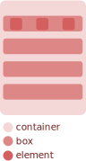

# CSStack (Beta)

## Summary
- <a href='#overview'>Overview</a>
- <a href='#working-with-the-main-containers'>Working with the main containers</a>
- <a href='#working-with-the-grid-system'>Working with the grid system</a>
- <a href='#how-to-install'>How to Install</a>
- <a href='#classes'>Classes</a>
- <a href='#contribution'>Contribution</a>
## Overview

<p> 
  Have you ever felt that positioning and styling mess a lot with your work organization?<br>
  If you use CSS without the assistance of any framework, for example, 
  your file starts getting too big, and if you use a framework like Bootstrap(which is amazing), 
  half of your HTML is destined for classes.
</p>
<p> 
  CSStack is a tiny CSS Grid framework built in SASS focused on the construction of the page structure.
  It is simple and easy-to-use, aiming to keep the CSS only for styling(fonts, colors...) and 
  polluting it with less lines.
</p>
<p>
  It has a responsive columns feature mixed with 'a box inside a box' concept which helps 
  getting those nasty elements in the place you want.
</p>
  
### Working with the main containers

Considering Below:
```
  <div class='stack'>
    <div class='queue between'>
      <div class='element'></div>
      <div class='element'></div>
      <div class='element'></div>
    </div>
    <div class='queue'></div>
    <div class='queue'></div>
    <div class='queue'></div>
  </div>
```
Which compiles to: <br>

<br>
- The 'container' element has the class 'stack', which stacks all elements inside itself.
- The 'box' elements have the class 'queue' each one, making that horizontal stacking.
  - Note that it also has the 'between' class, arranging the elements inside accordingly.
- And the 'elements' are commom elements.

### Working with the grid system

Working with the grid system is very based on bootstrap: It has columns from 1 to 12 and you can define it's responsiveness.

So creating something like this:<br>
```
  <div class='board'>
    <div col-4>
    <div col-4>
    <div col-4>
  </div>
```
Compiles to:<br>
 <br>

And if creates something like this:<br>
```
  <div class='board'>
    <div col-4>
    <div col-4>
    <div col-8>
  </div>
```
<br>
Compiles to:<br>


## How to Install

Install via NPM <br>
``` npm i csstack ``` <br>

Also you can include through jsdlivr <br>
``` https://cdn.jsdelivr.net/npm/csstack@1.2.4/css/master.css ``` <br>

For example, in the HTML: <br>
``` <link rel='stylesheet' href='https://cdn.jsdelivr.net/npm/csstack@1.2.4/css/master.css'> ``` <br>

## Classes 
### Containers

- **.stack**
  - Create a container which elements stack up vertically.
  
- **.queue**
  - Create a container which elements stack up horizontally.

### Grid

- **.board**
  - Create a container which elements stack up horizontally and enable the grid line break for subsequent items until reach 12 spaces(columns).

- **.col-1** (col-2, col-3... col-12)
  - Tells the elements to ocupy from 1 to 12 spaces in the container.

- **.col-m-1** (col-m-2, col-m-3... col-m-12)
  - Tells the elements to ocupy from 1 to 12 spaces in the container.
    - It Override previous col classes.
  
- **.col-l-1** (col-l-2, col-m-3... col-m-12)
  - Tells the elements to ocupy from 1 to 12 spaces in the container.
    - It Override previous col classes.

### Flex Helpers

- **.start**
  - Forces flex content to start.
  
- **.center**
  - Forces flex content center.
  
- **.end**
  - Forces flex content end.

- **.around**
  - Forces flex content around.

- **.between**
  - Forces flex content between.
  
## Contribution

Like the project? Give a star, issues, comments and pull requests are welcome.
  
